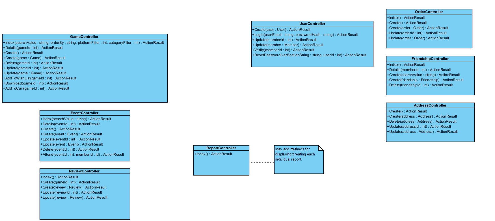

Game Controller
-----------------------------------

### Index
Displays the details page for a specific game.

### Create
Displays the create game view

### Create
Adds game to the database and redirects to the appropriate page.

### Delete
Deletes a game and redirects to the appropriate page.

### Update
Displays the update page for a specific game.

### Update
Updates a game and redirects to the appropriate page.

### AddToWishList
Adds the specified game to the logged in member's wishlist and redirects to the appropriate page.

### Download
Downloads the specified game and redirects to the appropriate page.

### AddToCart
Adds a specific game to the members cart (session variable) and redirects to the appropriate page.

### Delete
Deletes a game and redirects to the appropriate page.

Report Controller
-----------------------------------

### Index
Displays a page which lists the available reports which an employee can then select to see that particular report.

